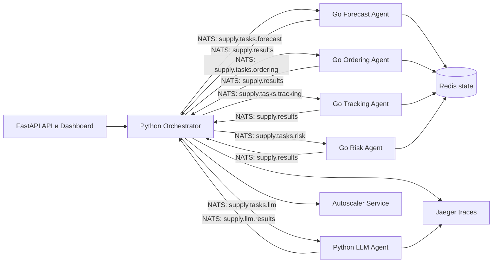

# Архитектура

Pipeline: прогнозирование спроса -> заказ у поставщика -> отслеживание поставки -> оценка рисков -> LLM-рекомендация.
Агенты реализованы одним универсальным Go-сервисом, специализация задаётся YAML-конфигурацией.
События pipeline доступны в REST API и на dashboard.
